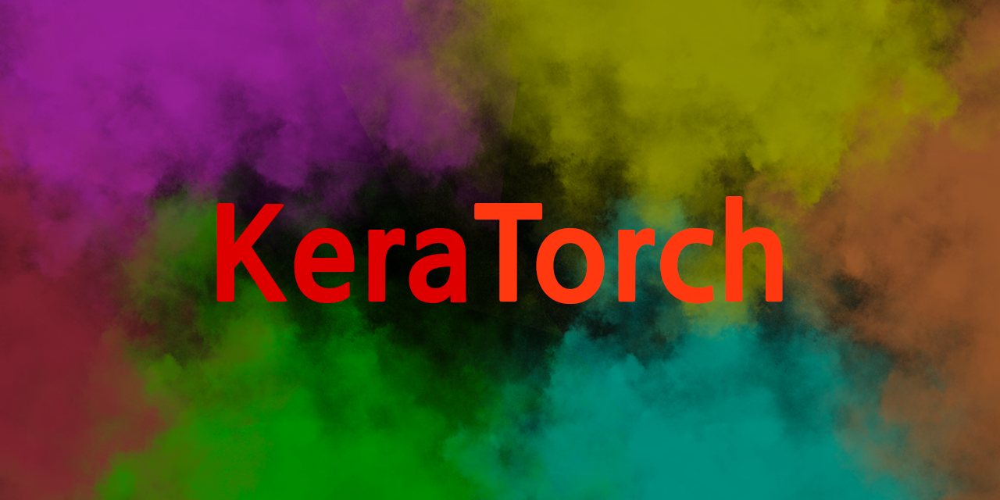

# KeraTorch : PyTorch-Like ML Framework

## Introduction

This project is a toy project to implement a PyTorch-like ML framework. The goal is to implement commonly used layers and optimizers, such as fully-connected layer, convolutional layer, ReLU activation, SGD optimizer, *etc*. 

## 📣 Shout Out To @omaraflak

This project is inspired by the Youtube video by [Omar Aflak](https://www.youtube.com/@independentcode), where he explains how to implement neural networks from scratch. 

In this project, auto-grad framework is supported. The framework is inspired by [PyTorch Autograd](https://pytorch.org/docs/stable/autograd.html). I am not sure if my version works similarly to PyTorch, but it is a good practice to implement auto-grad framework. My implementation is independent to PyTorch's one, so it may be poor in performance compared to PyTorch's one. 

## Technical Details

This project is written in Python. The main dependencies are `numpy`. 

## Milestones

> 🔥 **Feature, Not a Bug**
> - It should be tested if networks operate properly without batch. 
> - The gradient is not accumulated, which may cause problems when the same variable is used in different layers. 

- [x] 🌟 Array class supporting auto gradient calculation
  - [x] Basic array class
  - [x] Basic operations on array
    - [x] Addition
    - [x] Subtraction
    - [x] Scalar Multiplication
    - [x] Scalar Division
    - [x] Matrix Multiplication
    - [x] Real Number Power
    - [x] Expansion (vector -> 2d matrix)
    - [x] Sum with Axis
    - [x] L2 norm with Axis
    - [x] Reshape
    - [x] Backward Propagation
    - [x] Element-wise Multiplication
    - [x] Max / Min
    - [ ] Indexing
    - [ ] Slicing
    - [ ] In-place operations support
    - [ ] various dtype support (not only np.float64)
  - [x] Gradient Calculation
    - [x] Identity
    - [x] Add (variable number of inputs)
    - [x] Reshape
    - [x] Transpose
    - [x] Scalar Multiplication
    - [x] Matrix Multiplication
    - [x] Expansion
    - [x] Sum
    - [x] Power
    - [x] Element-wise Multiplication
    - [x] Max / Min
    - [ ] Indexing
    - [ ] Slicing
- [x] Overall backbone structure
  - [x] Layer base class
  - [x] Activation base class
  - [x] Loss base class
  - [x] Optimizer base class
- [ ] layers
  - [x] Fully-connected layer
  - [ ] Convolutional layer
  - [ ] Max pooling layer
  - [ ] Average pooling layer
  - [ ] Batch normalization layer
- [ ] activation functions (and their derivatives)
  - [x] ReLU
  - [x] Sigmoid
  - [x] Tanh
  - [ ] Softmax
- [x] Implement commonly used loss functions
  - [x] Mean squared error
  - [ ] Cross entropy
- [ ] Implement commonly used optimizers
  - [x] SGD
  - [ ] Momentum
  - [ ] RMSProp
  - [ ] Adam
- [ ] 🖥️ Demo
  - [x] OR binary classification
  - [x] XOR binary classification
  - [ ] MNIST classification
- [ ] *Additional Features*
  - [ ] computational graph visualization
  - [ ] initialization
  - [ ] dropout
  - [ ] CUDA support
- [ ] GitHub CI/CD
  - [ ] Python Linting
  - [ ] Unit Testing
  - [ ] Deployment
- [ ] Add more soon 😵